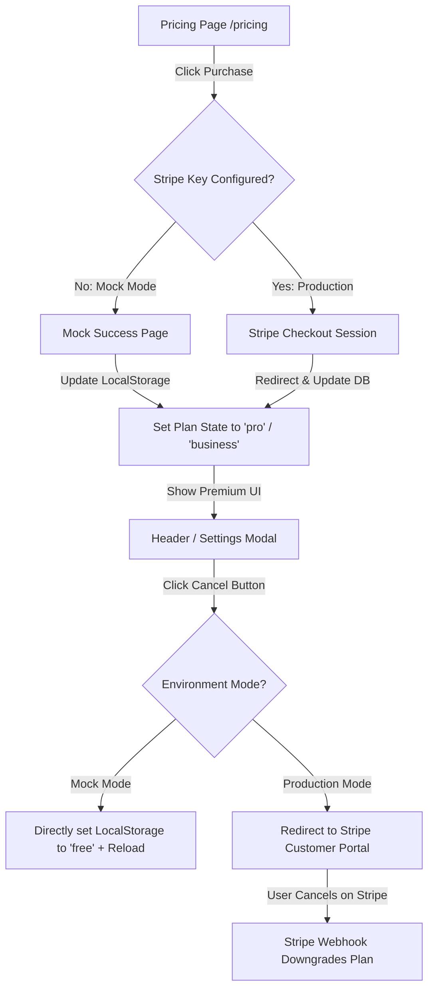

# Stripe Self-Serve Billing & Cancellation Integration Guide

This skill documents the reusable implementation patterns for adding automated user subscription billing and self-serve cancellation flows in React/Next.js applications. It supports both **development mock mode (using `localStorage` state)** and **production mode (using Stripe Checkout & Stripe Customer Portal)**.

---

## 1. Core Architecture

To keep the application operationally zero-maintenance (100% self-serve), user subscription status and cancellations should be fully automated:



---

## 2. Mock Billing State Pattern (LocalStorage)

For client-only or serverless mock billing, store the plan identifier in `localStorage` under a unique key (e.g. `[app_name]_user_plan`).

### Client-side state synchronization (Header/Profile Component)

```typescript
const [userPlan, setUserPlan] = useState<string>('free');

const updateStatus = () => {
  if (typeof window !== 'undefined') {
    const plan = localStorage.getItem('app_user_plan') || 'free';
    setUserPlan(plan);
  }
};

useEffect(() => {
  updateStatus();
  window.addEventListener('storage', updateStatus);
  window.addEventListener('app:plan_updated', updateStatus);
  return () => {
    window.removeEventListener('storage', updateStatus);
    window.removeEventListener('app:plan_updated', updateStatus);
  };
}, []);
```

---

## 3. Self-Serve Cancellation Button Pattern

Implement a "Cancel Subscription (解約する)" button next to the premium badge (e.g., PRO会員, 法人会員) in the Header or Settings Modal. It must dynamically handle mock-cancellation for local testing.

### Reusable UI Button Component

```tsx
{(userPlan === 'pro' || userPlan === 'business') && (
  <button
    onClick={() => {
      if (confirm('定期プランを解約しますか？\n解約後も現在の残り期間は継続してご利用いただけます。')) {
        // 1. Check if we are running in Mock Mode
        const isMockMode = process.env.NEXT_PUBLIC_STRIPE_MOCK === 'true' || !process.env.NEXT_PUBLIC_STRIPE_PUBLISHABLE_KEY;
        
        if (isMockMode) {
          // Mock Downgrade
          localStorage.setItem('app_user_plan', 'free');
          window.dispatchEvent(new Event('app:plan_updated'));
          alert('解約手続きが完了しました。フリープランに切り替わりました。');
          window.location.reload();
        } else {
          // Production: Redirect to Stripe Customer Portal API
          window.location.href = '/api/portal';
        }
      }
    }}
    className="rounded-full bg-red-50 hover:bg-red-100 text-red-600 px-2 py-0.5 text-[8px] sm:text-[9px] font-bold cursor-pointer border border-red-200"
  >
    解約する
  </button>
)}
```

---

## 4. Production API Configurations

### A. Backend Stripe Portal Endpoint (`app/api/portal/route.ts`)

For production, create a Stripe Customer Portal session and redirect the user there. Stripe handles card updates, invoices, and cancellations entirely.

```typescript
import { NextRequest, NextResponse } from 'next/server';
import Stripe from 'stripe';

export async function GET(req: NextRequest) {
  try {
    const stripeKey = process.env.STRIPE_SECRET_KEY;
    if (!stripeKey) {
      return NextResponse.json({ error: 'Stripe Key not configured' }, { status: 500 });
    }

    const stripe = new Stripe(stripeKey, { apiVersion: '2023-10-16' });
    const origin = req.headers.get('origin') || 'https://your-domain.com';

    // Retrieve logged-in user's Stripe Customer ID from your DB session
    const stripeCustomerId = 'cus_XXXXXXXXX'; 

    const session = await stripe.billingPortal.sessions.create({
      customer: stripeCustomerId,
      return_url: `${origin}/`,
    });

    return NextResponse.redirect(session.url);
  } catch (error: any) {
    console.error('Billing Portal Session Error:', error);
    return NextResponse.json({ error: error.message }, { status: 500 });
  }
}
```

### B. Stripe Webhook Handler (`app/api/webhooks/stripe/route.ts`)

Listen to Stripe webhooks to automatically process user downgrades upon cancellation:

- `customer.subscription.deleted`: Instantly downgrade the user's plan to `free`.
- `customer.subscription.updated`: Update the user's plan status if they change tiers.
